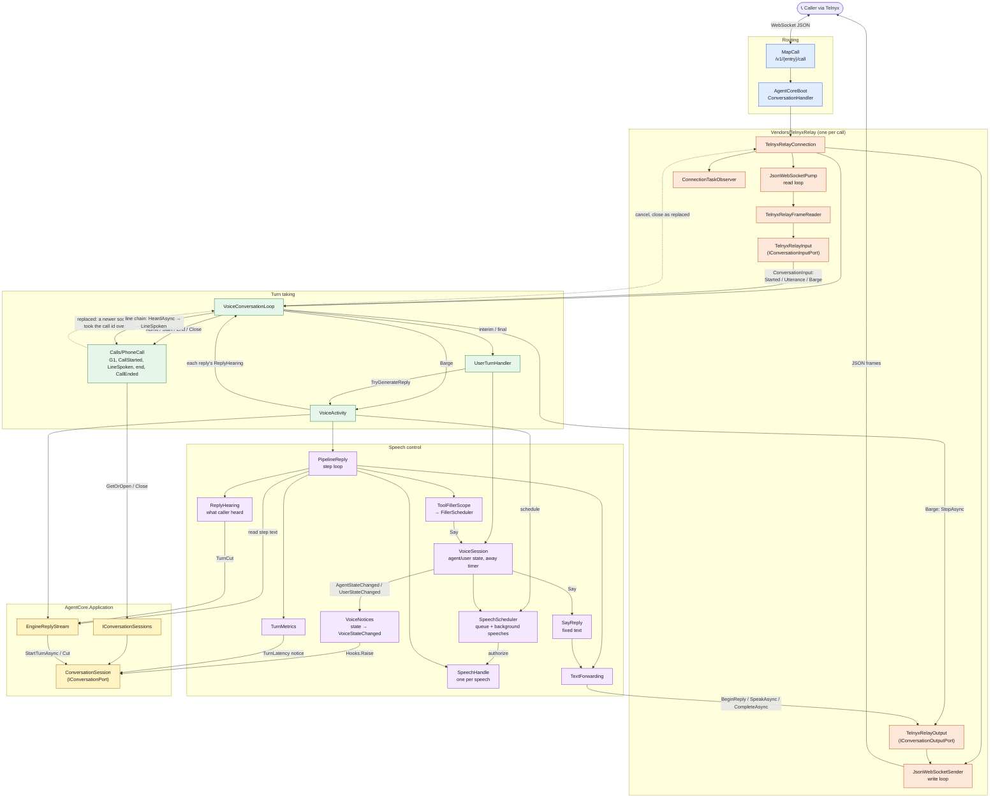

---
paths:
  - "src/AgentCore.AspNetCore/Voice/**"
  - "tests/AgentCore.AspNetCore.Tests/Voice/**"
---

# Voice components



```mermaid
sequenceDiagram
  autonumber
  participant T as Telnyx
  participant P as Pump + Input
  participant L as VoiceConversationLoop
  participant U as UserTurnHandler
  participant A as VoiceActivity
  participant S as SpeechScheduler
  participant R as PipelineReply
  participant E as EngineReplyStream → ConversationSession
  participant O as Output + Sender

  T->>P: setup frame
  P->>L: Started(conversationId)
  L->>L: PhoneCall.AdmitAsync (G1) + StartAsync, make VoiceActivity + UserTurnHandler
  T->>P: interim transcript
  P->>L: Utterance(IsFinal=false)
  L->>U: OnInterimTranscript → user Speaking
  T->>P: final transcript
  P->>L: Utterance(IsFinal=true)
  L->>L: queue the caller line behind any held agent line
  L->>U: OnFinalTranscript
  U->>A: InterruptByFinalTranscript (cut old speech; earlier replies' barge windows wait HeardTextWait, then close)
  U->>A: TryGenerateReply(text)
  A->>E: Start engine turn
  A->>L: reply's ReplyHearing → held agent line queued
  A->>S: ScheduleSpeech(handle)
  S->>R: authorize speech
  R->>R: wait for user silence
  loop each model step
    E-->>R: step text
    R->>O: BeginReply / SpeakAsync / CompleteAsync
    O->>T: speak frames
    opt step calls a tool
      R->>R: WaitForToolsAsync (filler may Say)
      R->>S: re-schedule (force) for next step
    end
  end
  R->>S: speech done → agent Listening, away timer armed
  Note over L,R: The held agent line is raised (PhoneCall.HeardAsync, the reply's turn) with ReplyHearing.HeardText once<br/>the speech is done and its barge window closed: a barge report for it; the next final prompt, once the report<br/>that may follow it had its HeardTextWait (a later report changes nothing, and is logged); or DrainAsync, at once<br/>(an interrupted reply settled its cut already, so its window closes when its speech is done)
  Note over T,O: Barge-in: Telnyx sends Barge → Loop calls Output.StopAsync<br/>and VoiceActivity.InterruptByAudioActivity → ReplyHearing cuts the engine turn to what was heard
```
